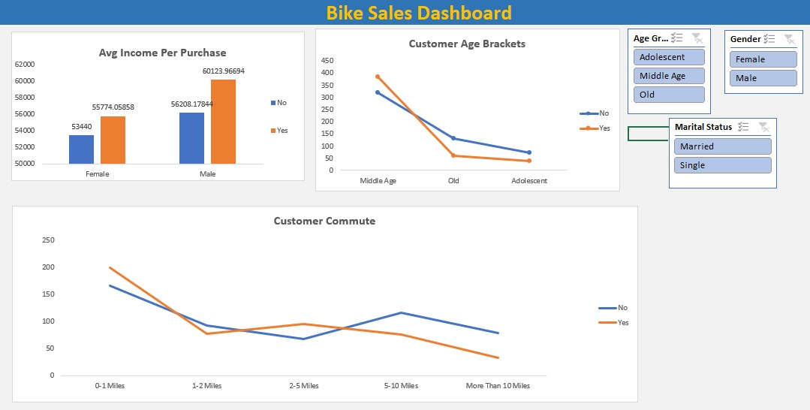

# 🚴 Bike Sales Dashboard | Excel Data Analysis Project

## Overview

This project presents an interactive **Bike Sales Dashboard** built using Microsoft Excel to analyze customer demographics and purchasing behavior. The dashboard provides insights into how factors such as income, age, gender, marital status, and commute distance influence bike purchase decisions.

The goal of this project is to transform raw customer data into meaningful visual insights that can support business decision-making and targeted marketing strategies.

---

## Dashboard Preview



---

## Business Objective

The purpose of this analysis is to identify patterns and trends among customers who purchase bikes and understand the key factors that influence purchasing behavior.

### Key Questions Answered

- How does customer income affect bike purchases?
- Which age group purchases bikes most frequently?
- Does commute distance influence buying decisions?
- How do gender and marital status impact bike purchases?
- Which customer segments should businesses focus on?

---

## Dataset Information

The dataset contains customer demographic and lifestyle information, including:

- Customer ID
- Gender
- Age
- Marital Status
- Income
- Education
- Occupation
- Region
- Commute Distance
- Bike Purchase Status

The data was cleaned, validated, and analyzed before being used to create the dashboard.

---

## Dashboard Features

### 📊 Average Income Per Purchase

Compares average income levels between customers who purchased bikes and those who did not.

**Insight:** Customers with higher incomes are more likely to purchase bikes.

---

### 👥 Customer Age Analysis

Customers are segmented into:

- Adolescent
- Middle Age
- Old

**Insight:** Middle-aged customers represent the largest group of bike purchasers.

---

### 🚲 Commute Distance Analysis

Analyzes purchasing behavior based on commute distance categories:

- 0–1 Miles
- 1–2 Miles
- 2–5 Miles
- 5–10 Miles
- More Than 10 Miles

**Insight:** Customers with shorter commute distances tend to purchase bikes more frequently.

---

### 🎛 Interactive Filters

The dashboard includes slicers that allow users to filter data by:

- Gender
- Marital Status
- Age Group

These filters enable dynamic exploration of customer segments and purchasing patterns.

---

## Tools & Techniques Used

### Microsoft Excel

#### Data Preparation
- Data Cleaning
- Data Validation
- Data Formatting

#### Data Analysis
- Pivot Tables
- Pivot Charts
- Data Aggregation

#### Dashboard Development
- Interactive Slicers
- Column Charts
- Line Charts
- Dynamic Reporting

---

## Key Insights

### Income Analysis
Customers who purchased bikes generally have a higher average income than those who did not.

### Age Group Analysis
Middle-aged customers account for the highest number of bike purchases.

### Commute Distance Analysis
Purchase rates are highest among customers with shorter commute distances.

### Customer Segmentation
Demographic factors such as gender and marital status influence purchasing behavior and provide opportunities for targeted marketing.

---

## Project Workflow

```text
Raw Dataset
     ↓
Data Cleaning
     ↓
Data Validation
     ↓
Pivot Table Analysis
     ↓
Dashboard Development
     ↓
Business Insights
```

---

## Repository Structure

```text
bike-sales-dashboard-excel/
│
├── excel project 2.xlsx
├── Dashboard.jpeg
└── README.md
```

---

## How to Use

1. Download the repository files.
2. Open `excel project 2.xlsx`.
3. Navigate to the Dashboard worksheet.
4. Use the slicers to filter data by:
   - Gender
   - Age Group
   - Marital Status
5. Explore customer purchasing trends and insights.

---

## Skills Demonstrated

- Data Cleaning
- Data Analysis
- Data Visualization
- Dashboard Design
- Business Intelligence Reporting
- Customer Segmentation
- Pivot Tables
- Pivot Charts
- Interactive Dashboard Development

---

## Key Learning Outcomes

Through this project, I gained practical experience in:

- Building interactive Excel dashboards
- Analyzing customer purchasing behavior
- Creating meaningful visualizations
- Presenting business insights effectively
- Supporting business decisions through data analysis

---

## Future Enhancements

- Develop a Power BI version of the dashboard
- Add predictive analytics for purchase forecasting
- Integrate Power Query for automated data refresh
- Expand customer segmentation analysis
- Include advanced KPI tracking metrics

---

## 👨‍💻 Author

**Shaik Abbas**

- GitHub: https://github.com/iamshaikabbas
- LinkedIn: https://www.linkedin.com/in/shaik-abbas-a5a723287/

---

## Conclusion

This project demonstrates how Excel can be used as a powerful data analysis and business intelligence tool. By combining data cleaning, visualization, and dashboard design techniques, the Bike Sales Dashboard provides actionable insights into customer purchasing behavior and supports data-driven decision-making.
